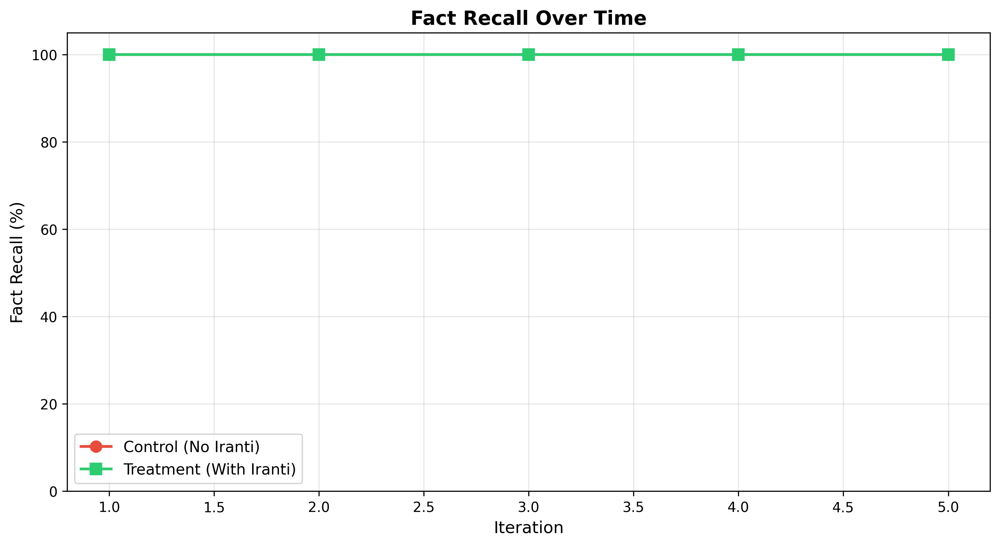
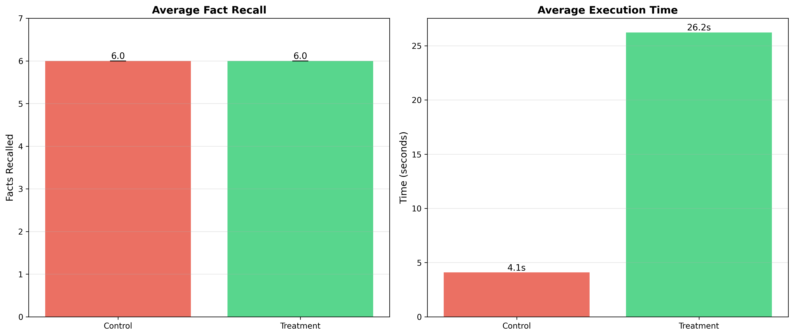
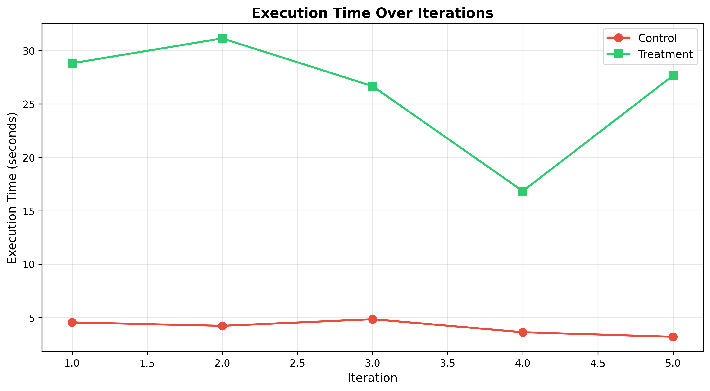
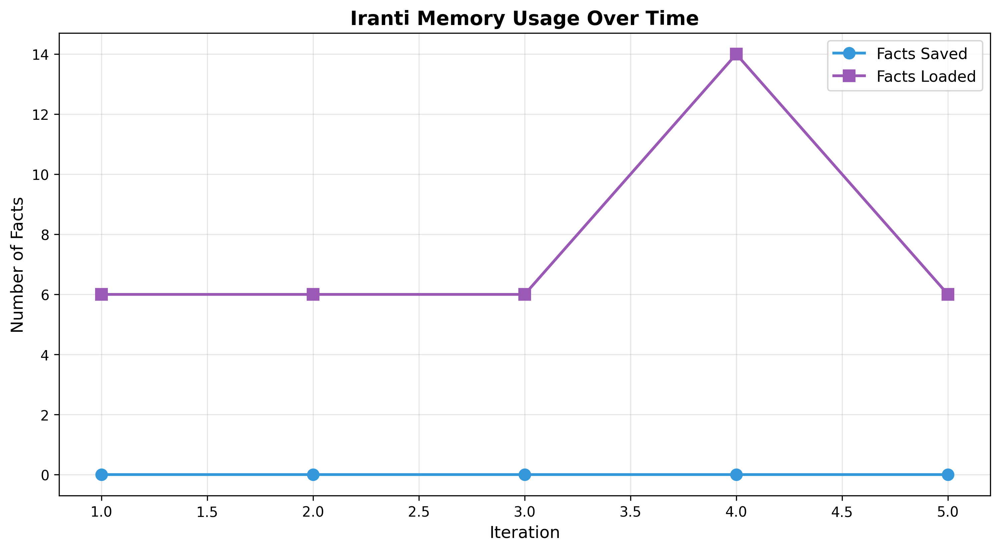

# Stress Test Report

**Experiment**: stellar_nexus_stress_test  
**Entity**: project/stellar_nexus  
**Test Date**: 2026-03-01T01:18:45.569965  
**Iterations**: 5  

## Summary

### Fact Recall
- **Control**: 6.0/6 ± 0.00 (5/5)
- **Treatment**: 6.0/6 ± 0.00 (5/5)
- **Delta**: +0.0 (+0.0%)

### Execution Time
- **Control**: 4.09s
- **Treatment**: 26.23s
- **Overhead**: 22.14s (541.3% slower)

## Visualizations

## Conclusion

Both control and treatment achieved 100% fact recall. Treatment demonstrates persistent memory across sessions with expected performance overhead.
