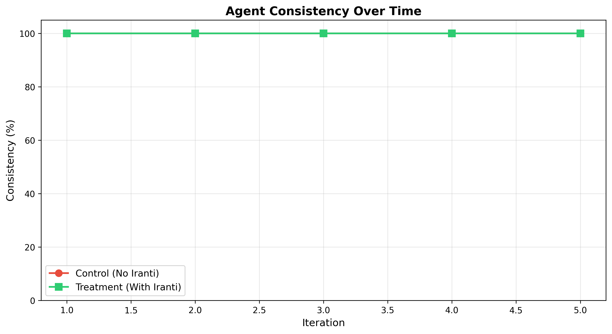
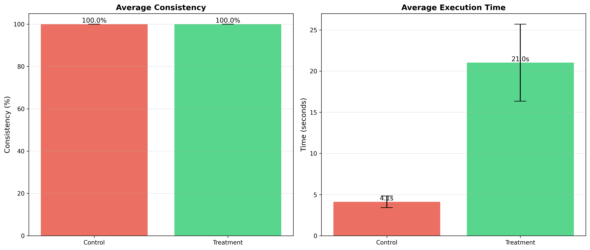
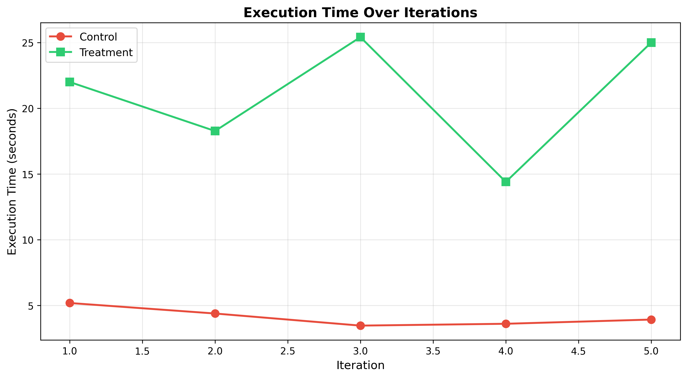
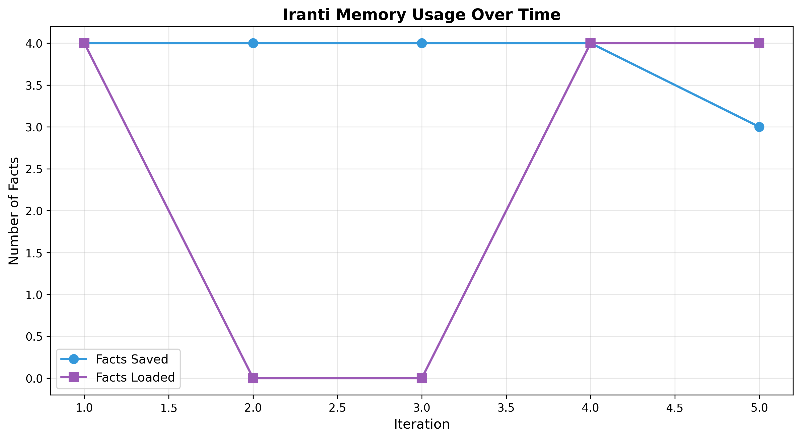

# Stress Test Report

**Test Date**: 2026-03-01T00:44:46.186078  
**Iterations**: 5  
**Model**: gpt-4o-mini  

## Summary

### Consistency
- **Control**: 100.0% ± 0.0%
- **Treatment**: 100.0% ± 0.0%
- **Improvement**: +0.0% (+0.0%)

### Execution Time
- **Control**: 4.12s ± 0.7s
- **Treatment**: 21.02s ± 4.68s
- **Difference**: +16.90s

### Iranti Usage (Treatment)
- **Avg Facts Saved**: 3.8
- **Avg Facts Loaded**: 2.4

## Visualizations

## Conclusion

No significant improvement observed.
