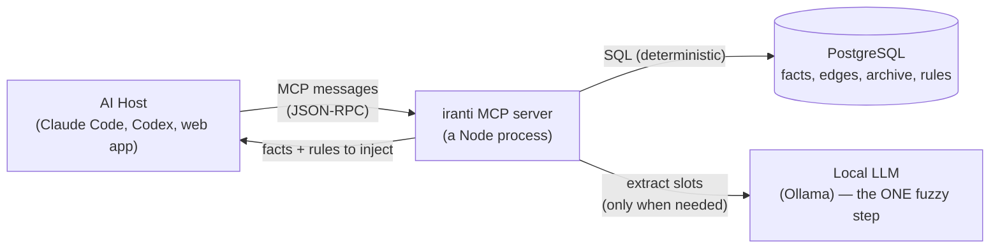
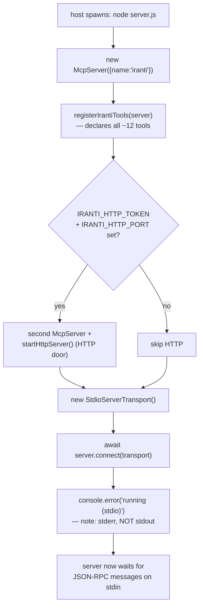
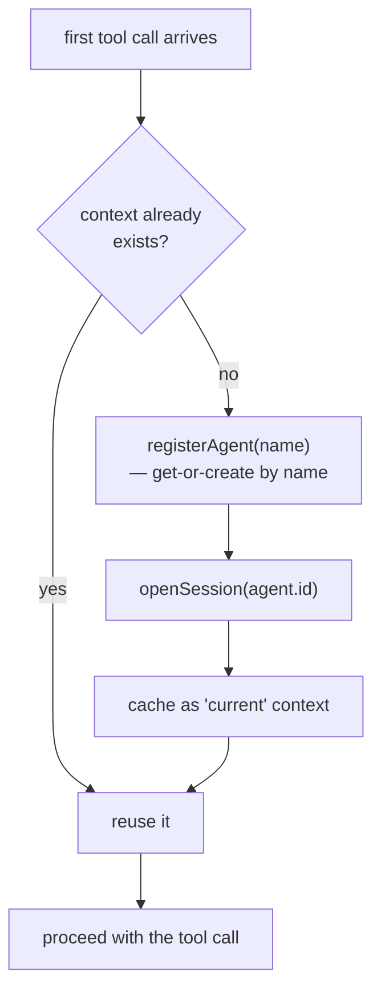
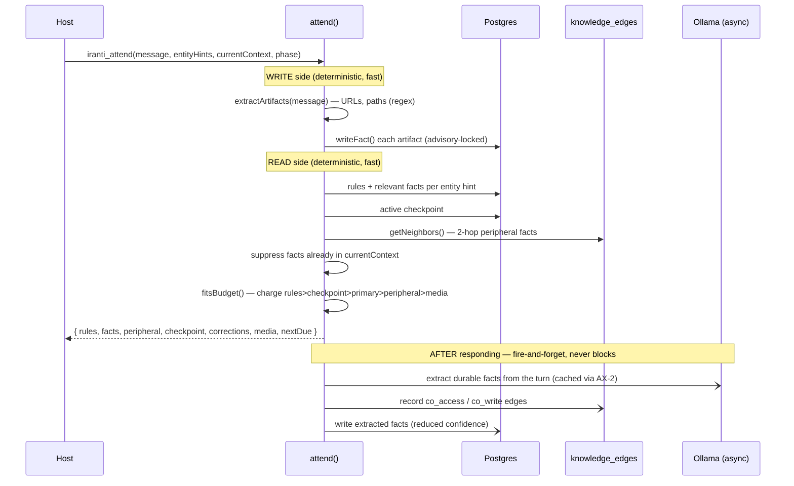
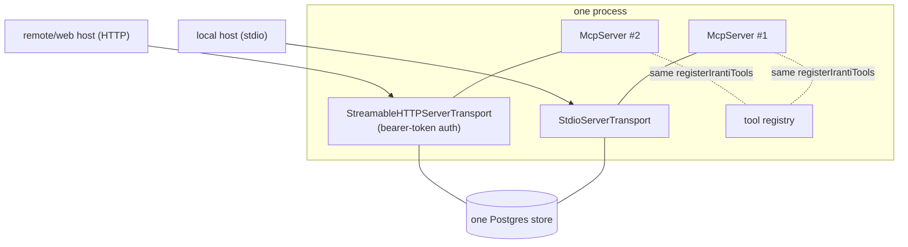
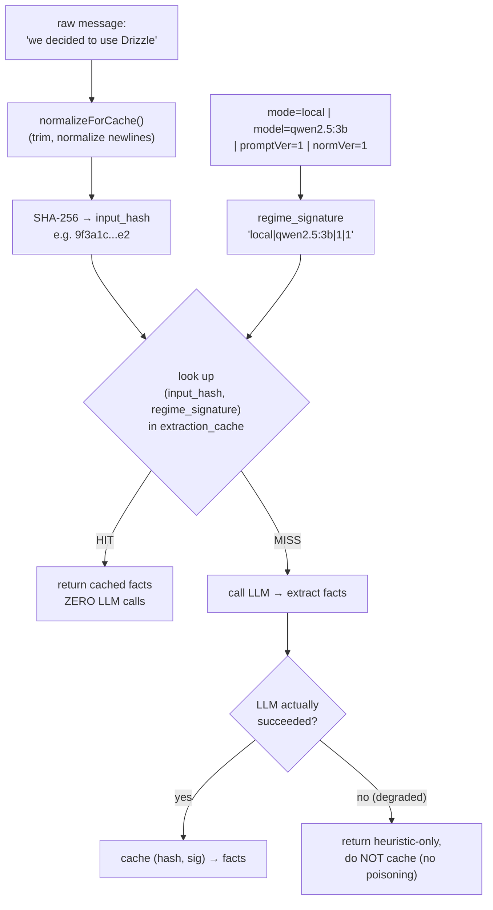
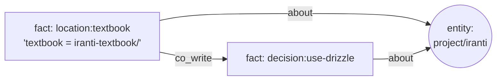
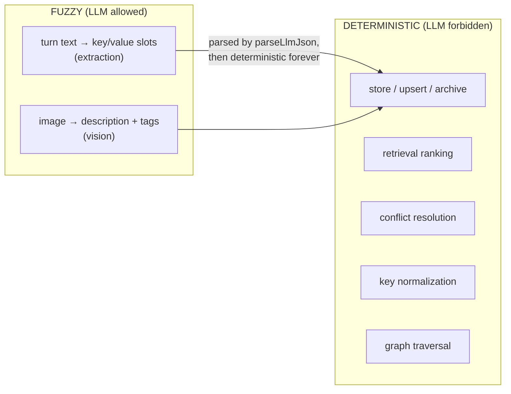

# iranti — Mechanics Deep-Dive (how it *actually* works)

**Status:** draft for NF review · **Date:** 2026-06-29 · **Author:** Claude (with NF)
**Purpose:** the shipped-feature recap explained *what* each piece does and *why*. This explains the **mechanism** — what literally happens, step by step, when a host talks to iranti — plus non-technical visuals of the store, hashing, and the graph. It exists because "a file runs the server" is a label, not an explanation.

**How to read this:** the diagrams are the point; the prose connects them. The visuals are written in **Mermaid**, which renders as real diagrams in GitHub and in VS Code (with a Mermaid preview extension). If you're reading raw text, each diagram has a one-line caption telling you what it shows. I relink to the three guarantees (**G1** deterministic/correctable, **G2** host-portable, **G3** local-first/private) so each mechanism stays tied to *why* it exists.

---

## 1. The 10,000-foot picture

iranti is a separate process that sits between your AI host and a Postgres database. The host never touches the database; it only speaks a protocol (MCP) to iranti, and iranti does the deterministic work.



*Caption: the host talks MCP to iranti; iranti talks SQL to Postgres and only reaches for the LLM at the single fuzzy step.*

The key thing to notice: **the host is dumb about memory.** It doesn't know about tables or hashing or graphs. It just calls a tool called `iranti_attend` and gets back "here's what you should know." Everything hard happens inside iranti, deterministically (**G1**), and because the contract is just MCP, *any* host can do this (**G2**).

---

## 2. How the server actually boots

When your host launches iranti, it runs `node dist/mcp/server.js`. Here is what that file actually does, in order ([src/mcp/server.ts](../../src/mcp/server.ts)):



*Caption: the boot sequence. The server doesn't 'run' in a loop you wrote — it connects a transport and waits for protocol messages.*

**What "the server works" actually means — the part my Phase 1 explanation skipped:**

1. **`McpServer`** is an object from the MCP SDK. It's a *registry + dispatcher*: you tell it "here are my tools and their handlers," and it knows how to receive a protocol message like *"call tool `iranti_attend` with these args"* and route it to your handler.
2. **`registerIrantiTools(server)`** ([src/mcp/register.ts](../../src/mcp/register.ts)) is where each tool is declared. For every tool it calls `server.registerTool(name, {title, description, inputSchema}, handler)`. The `handler` is an `async` function that (a) calls the matching library function, (b) wraps the result as MCP "content," (c) catches errors into a clean error response. So `iranti_attend` the *protocol tool* is a thin wrapper around `attend()` the *function*.
3. **`StdioServerTransport`** is the pipe. stdio = standard-in / standard-out, the two text streams every process has. The host writes JSON-RPC request lines to iranti's **stdin**; iranti writes JSON-RPC responses to its **stdout**. That's the entire wire. This is why the code is religious about **never `console.log`** — `console.log` writes to stdout, which would inject garbage into the protocol stream and corrupt it. Diagnostics go to **stderr** (`console.error`), which the host shows in logs but doesn't parse as protocol.
4. **`server.connect(transport)`** wires the dispatcher to the pipe and starts listening. There's no `while(true)` loop in our code — Node's event loop is the loop; the server is now event-driven, waking up whenever a message arrives on stdin.

So "a file runs the server" really means: *the file constructs a tool registry, attaches it to the stdin/stdout pipe, and hands control to the event loop.* When a message arrives, the SDK parses it, finds the named tool, and calls our handler.

The shutdown path matters too: on `SIGINT`/`SIGTERM` the server closes the HTTP listener (so the port frees up for a restart), closes the open session, and ends the DB pool. Hosts often just *kill* the process instead, so session cleanup is best-effort by design.

---

## 3. The handshake (how iranti knows who it's talking to)

The host never "logs in." Instead, the **first tool call** lazily creates the agent and session — "first-call-wins" ([src/mcp/context.ts](../../src/mcp/context.ts)):



*Caption: the handshake is implicit and happens once per process. Concurrent first-calls share one handshake (a `pending` promise) so you never get duplicate sessions.*

The clever bit is `pending ??= (async () => {...})()`: if two calls arrive at almost the same instant before either finishes, they both await the *same* promise, so exactly one agent+session is created, not two. That's a small determinism guard (**G1**) at the concurrency boundary.

This is also where the current single-process model lives: **one host process = one server process = one agent.** Serving *many* agents from one server (the multi-agent / fleet story) is a Phase-5 concern that rides on the HTTP transport.

---

## 4. A single `attend`, end to end (the most important diagram)

This is the whole system in one call. When the host is about to respond to you, it calls `iranti_attend`. Here's everything that happens ([src/mcp/tools/attend.ts](../../src/mcp/tools/attend.ts)):



*Caption: one attend. Everything above the second `Note` is synchronous and deterministic and happens before the host responds. Everything below runs after the response is already sent, so iranti adds ~no latency.*

The mental model to keep: **attend has a fast deterministic spine (read the right facts, return them under budget) and a slow fuzzy tail (LLM extraction) that runs off the response path.** The user never waits on the LLM. That separation is the determinism principle made physical.

---

## 5. Two doors, one room (stdio + HTTP)



*Caption: stdio and HTTP each get their own `McpServer` object (the SDK allows one transport per object), but both register the identical tool surface and both read/write the same Postgres. A fact written over stdio is instantly visible over HTTP.*

Mechanically, HTTP ([src/mcp/http.ts](../../src/mcp/http.ts)) is the same JSON-RPC messages, just carried in HTTP POST bodies instead of over stdin, with a `Bearer` token check on every request. The transport is *stateless* (no session tracking) because the tool registry itself is stateless — all state lives in Postgres. This is the seam the Phase-5 cloud/web story slots into (**G2**, **G3**'s opt-in cloud layer).

---

## 6. What the tables actually look like (the non-technical view you asked for)

Forget the schema code. Here's what a few rows *literally* look like after you tell an agent "we decided to use Drizzle, and the textbook is in the iranti-textbook folder."

**`facts`** — the live memories (one row = one atomic fact):

```
 entity_type | entity_id | key                     | value                                  | confidence | source
-------------+-----------+-------------------------+----------------------------------------+------------+------------------
 project     | iranti    | decision:use-drizzle    | Chose Drizzle over Prisma (raw-SQL)    | 0.85       | extractor_llm
 project     | iranti    | location:textbook       | textbook lives in iranti-textbook/     | 0.80       | extractor_llm
 project     | iranti    | checkpoint              | {where you left off ...}               | 1.00       | iranti_checkpoint
```

**`fact_archive`** — nothing is ever destroyed; old values land here (this is **G1**):

```
 fact_id (same UUID) | key                  | value (OLD)                  | archived_reason | archived_at
---------------------+----------------------+------------------------------+-----------------+-------------
 a1b2...              | decision:use-drizzle | Considering Prisma or Drizzle| superseded      | 2026-06-29
```

*Notice the `fact_id` is the same as the live row's — the fact kept its identity; only its value moved to the archive when it changed. That's why you can ask "show me the history of `decision:use-drizzle`" and get every value it ever held.*

**`knowledge_edges`** — how facts relate (this powers graph retrieval):

```
 source (fact)        | relation  | target (fact / entity)   | weight
----------------------+-----------+--------------------------+--------
 decision:use-drizzle | co_write  | location:textbook        | 1     (written same turn)
 decision:use-drizzle | about     | entity: project/iranti   | 1     (this fact is about that entity)
```

That's the whole "database" most of the magic runs on: a table of current facts, a table of their past, and a table of how they connect.

---

## 7. How a key gets hashed and cached (AX-2, worked example)

This answers your "what does hashing look like" question concretely. When the LLM extractor runs, iranti first checks whether it has *already* extracted this exact input under the exact same conditions — so it never pays for the same extraction twice.



*Caption: the cache key is two parts — a fingerprint of the **input** and a fingerprint of the **conditions**. Change the prompt, model, or normalizer and the `regime_signature` changes, so stale extractions are never served.*

**Why a hash and not the raw text?** Because the hash is a fixed-size fingerprint: identical inputs produce an identical hash, so lookup is a single indexed equality check. And — tying back to the privacy boundary (**G3** / master §11) — the hash plus the extracted facts live in *your* instance, never in developer telemetry. (The `llmSucceeded` gate in the bottom branch is the bug we fixed: a transient Ollama outage must not cache a thin degraded result and poison every future lookup.)

---

## 8. The graph, and the "textbook" problem

Right now edges are *behavioural*: facts written together (`co_write`) or retrieved together (`co_access`) get linked, and every fact links to its entity (`about`).



*Caption: today's graph links facts by co-occurrence and to their entity. It does NOT yet link by meaning.*

**The gap your textbook example exposes:** when you said "the textbook" and meant `iranti-textbook/`, the old system stored two *separate* observations and never linked "textbook" → the entity. That's two missing capabilities, and naming them precisely matters:

- **An alias edge / entity resolution** — a learned link "the word *textbook* resolves to entity `project/iranti-textbook`," stored once and applied forever. (This is the deferred **AX-1 Layer-2** synonym map.)
- **A semantic "why" on edges** — today an edge says *that* two facts are related (`co_write`), not *why* ("B depends on A," "B is an alias of A"). Adding a typed reason is what would let retrieval rank by *meaning*, not just co-occurrence.

Both are real, both are unbuilt, and both are why the old system's recall felt weak. They're high on the deep-dive list.

---

## 9. Where the LLM is — and isn't

If you remember one boundary, remember this one:



*Caption: the LLM touches exactly two edges (extraction, vision). Everything downstream is pure. `parseLlmJson` is the single gate that turns the LLM's messy output into deterministic data.*

This is the thesis as a wiring diagram. Every guarantee (**G1/G2/G3**) depends on keeping that left box small and that right box pure.

---

## 10. Questions this doc surfaces (feeders for the deep-dive ranking)

Writing the mechanics out makes some open questions sharp:

1. **Entity resolution / alias edges** (§8) — the "textbook" fix. High daily-friction.
2. **Semantic "why" on edges** (§6, §8) — typed relations to rank by meaning.
3. **Multi-agent / fleets** (§3) — the single-process handshake model has to grow for coworking. Phase-5-adjacent.
4. **Setup/onboarding** — boot is per-process today; the "one instance for a whole Projects folder, auto-scope per project" idea changes how §2–§3 work.
5. **Context-dependent facts** — "I think SQLAlchemy is best" is a *situational* opinion, not a durable preference. Extraction (§4, §9) needs to capture the *context* a fact was true in, not just the slot.
6. **PG vs. markdown** — §6 shows how little the store actually is; worth honestly testing whether a file-based store could do the same (verify ByteRover's reported move, steelman it).

---

*This doc is mechanism only. The shipped-feature recap (goal/why/ties-back) and the decision register (open-decisions.md) are its companions.*
